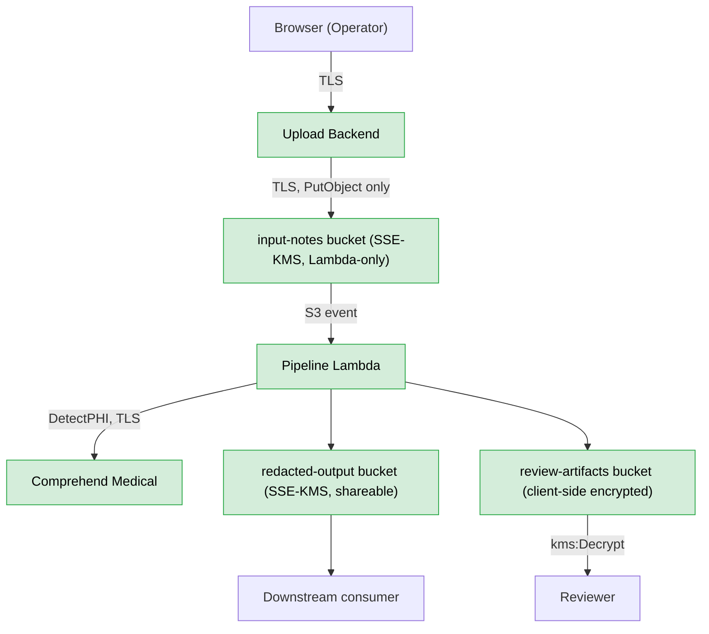

# Patient De-Identification Pipeline

Automated, auditable redaction of protected health information (PHI) from
unstructured clinical text, against HIPAA's Safe Harbor standard — built to
demonstrate secure operationalization of an existing detection engine
(AWS Comprehend Medical), not novel PHI detection. See
`docs/decision-log.md` for why.

## Why

Healthcare has been the costliest industry for data breaches for over a
decade, and most PHI exposure happens downstream of the originating
hospital — through third-party vendors, analytics platforms, and AI
pipelines that received data secondhand. This project sits at exactly that
handoff point: making clinical text safe to share before it leaves.

Full background: `docs/functional-requirements.md`.

## Status

**Phases 1–5 done.** The pipeline runs in
AWS end to end: an Operator uploads a note through the Cognito-protected
frontend, the Pipeline Lambda detects PHI with Comprehend Medical plus a regex
backstop for Australian mobile numbers, and writes the redacted note and an
encrypted review queue that Reviewers open in their own UI. The FR-4
confidence threshold is settled at **0.001**, derived from a stated cost ratio
and three rounds of corpus testing against the live API rather than guessed.
CI runs the offline test suite on every push and PR, and deploys the Lambdas
and the frontend from `main`. Outstanding: the backstop closes the AU mobile
formats that were measured, not the US-centric detection bias underneath them,
and Comprehend Medical's `ADDRESS` false positives on phrases like
"physiotherapy department" are accepted as noise rather than fixed — all
tracked in [`docs/decision-log.md`](docs/decision-log.md).

## Phases

| Phase | Scope | Status |
|---|---|---|
| 1. Requirements & repo | This doc set | ✅ Done |
| 2. Application | Local `detect_phi()` + `redact()` proof of concept, no AWS infra | ✅ Done |
| 3. Infrastructure | Terraform: S3, IAM, KMS | ✅ Done |
| 3.5. Frontend / Operator UI (API Gateway upload endpoint, static site)| Not in original scope — added 2026-09-20 after discovering the CLI required source-code edits to process a new file, with no real operator-facing path | ✅ Done |
| 4. CI/CD | Automated testing + deploy pipeline: GitHub Actions runs the test suite on every push/PR, and deploys the Lambdas (after tests pass) and the frontend from `main` via OIDC — no stored AWS keys | ✅ Done |
| 5. Security hardening | Least-privilege IAM, storage protection (S3 versioning, TLS-only buckets), token lifetimes, audit logging | ✅ Done 2026-09-26 — versioning and TLS-only on every bucket, 1-hour refresh tokens, 1-day expiry of raw notes, CloudTrail logging of reads on the review queue |

## Docs

- [`docs/functional-requirements.md`](docs/functional-requirements.md) — what this does and why
- [`docs/technical-requirements.md`](docs/technical-requirements.md) — how it's built
- [`docs/decision-log.md`](docs/decision-log.md) — key decisions and rationale

## Setup

```bash
pip install -r requirements-dev.txt
aws configure  # if not already set up — needs Comprehend Medical access
python -m src.deid.pipeline
```

Run from the repo root. The local pipeline isn't a drop-in run anywhere else:
it's tied to the AWS account this project was deployed in.

- It uses a named AWS profile, `patient-deid`, not the default one, so plain
  `aws configure` isn't enough; use `aws configure --profile patient-deid`.
- It encrypts the review queue with this deployment's own KMS key
  (`REVIEW_ARTIFACTS_KMS_KEY_ID` in `src/deid/review_cli.py`). In another
  account, apply the Terraform and point that constant at your own key first.
- It calls Comprehend Medical live, which bills the account, and it only
  processes the fixed sample note, `tests/fixtures/sample_note.txt`.

Tests:

```bash
python -m pytest            # offline and free
python -m pytest -m live    # opt-in; calls real AWS
```

## Deployment

| What | How | When |
|---|---|---|
| Tests | `.github/workflows/test.yml`, `test` job | Every push and PR to `main` |
| Lambda code (all three functions) | `test.yml`, `deploy` job — one zip of `src/`, `update-function-code` + wait | Push to `main`, only after tests pass |
| Frontend (`site/`) | `.github/workflows/deploy-frontend.yml` — `s3 sync --delete` + CloudFront invalidation | Push to `main` touching `site/**`, or run manually |
| Infrastructure | `terraform plan` / `apply`, run by a person | By hand, never from CI |

Terraform no longer deploys Lambda code: `source_code_hash` is ignored, so a
later `apply` can't overwrite what CI shipped. To deploy code by hand, use
`aws lambda update-function-code`. See `docs/decision-log.md`, "Phase 4
closed".

## Data

`tests/fixtures/` contains synthetic clinical notes only. No real PHI has
ever been or will be committed to this repository.

## Architecture



Everything shown is provisioned in AWS via Terraform (Comprehend Medical is
the managed service it calls). See `docs/decision-log.md` for the reasoning
behind each piece.